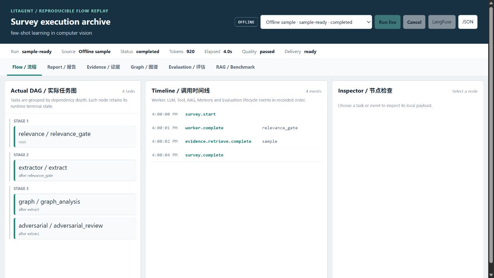
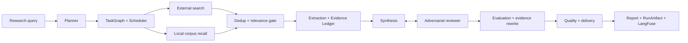

# LitAgent

[](./README.md)
[](./README.zh-CN.md)

LitAgent is an evidence-grounded literature survey system built around dynamic
multi-agent orchestration, adversarial review, hybrid retrieval, and explicit
quality-to-delivery policy.

A research query is decomposed into a runtime DAG. Search and local recall feed
a provenance-aware evidence ledger, synthesis is challenged by an adversarial
review loop, and the final report is evaluated before it can be marked ready for
delivery. Every run can be inspected through a local RunArtifact and optional
LangFuse trace.

## Project Status

| Area | Status | Evidence |
| --- | --- | --- |
| Runtime DAG and adversarial survey flow | Implemented | [`runner.py`](./src/litagent/runner.py), [`test_phase14_4_e2e.py`](./tests/test_phase14_4_e2e.py) |
| Persistent paper corpus and PDF ingestion | Implemented | [`rag/`](./src/litagent/rag), [`test_phase14_1.py`](./tests/test_phase14_1.py) |
| Retrieval benchmark | Completed | [`RESULTS.md`](./benchmarks/rag/RESULTS.md) |
| End-to-end Survey benchmark | Implementation complete; 39-run live acceptance pending | [`benchmarks/survey`](./benchmarks/survey), [`test_phase14_5.py`](./tests/test_phase14_5.py) |
| Reproducible flow replay | Implemented | [`demo.py`](./src/litagent/demo.py), [`test_phase14_6.py`](./tests/test_phase14_6.py) |

The complete evidence ledger for public capability claims is maintained in
[`docs/design-truth.md`](./docs/design-truth.md).

## Quick Start

### Offline replay

The offline mode requires no API key, Docker service, model download, or network
access. It opens three bundled artifacts that demonstrate ready, blocked, and
partial delivery states.

```powershell
pip install -e ".[api]"
litagent demo
```

The browser opens at `http://127.0.0.1:8000/flow-demo`. To run without opening a
browser:

```powershell
litagent demo --no-browser
```

Bundled samples are deterministic contract fixtures. They are not model-quality
or benchmark evidence.



### Live survey

Copy `.env.example` to `.env`, configure an OpenAI-compatible LLM key, and start
the project infrastructure:

```powershell
pip install -e ".[dev]"
docker compose up -d
litagent demo --live
```

LangFuse is optional. When configured, the replay exposes a direct link to the
run trace. Local artifacts remain under `artifacts/runs/` and are excluded from
Git because they may contain prompts, paper excerpts, and model output.

## System Overview



The runtime is asynchronous. Search providers and local recall can execute in
parallel, as can extraction and graph analysis after relevance filtering. The
scheduler converges every task to a terminal state during failures, cancellation,
or timeout so that an artifact never presents unfinished work as complete.

See [`docs/system-overview.md`](./docs/system-overview.md) for the public data-flow,
trust, persistence, and degradation contracts.

## Query-to-Delivery Flow

1. **Planner** decomposes the query into normalized sub-queries and a dependency DAG.
2. **Search and Recall** combine external academic sources with the persistent local corpus.
3. **Dedup and Relevance Gate** merge paper identities, rank candidates, and reject weak matches.
4. **Extraction and Graph Analysis** produce evidence items, claims, locators, and paper structure.
5. **Synthesis and Adversarial Review** generate and challenge a draft against the same run-scoped evidence selection.
6. **Evaluation and Rewrite** score citations, internal consistency, and faithfulness; a repair candidate is committed only after validation and re-evaluation.
7. **Quality and Delivery** map execution completeness and content quality to `ready`, `needs_review`, `blocked`, or `partial`.
8. **Observability** persists the full local artifact and sends recursively redacted telemetry to LangFuse when enabled.

## Verified Capabilities

| Capability | Implementation boundary | Verification |
| --- | --- | --- |
| Dynamic DAG scheduling | Dependency-aware dispatch, retries, timeout, cancellation, skipped downstream tasks | [`test_orchestrator.py`](./tests/test_orchestrator.py), [`test_phase14_4_e2e.py`](./tests/test_phase14_4_e2e.py) |
| Hybrid paper retrieval | Named dense vectors, BM25 sparse vectors, RRF, optional CrossEncoder reranking | [`retriever.py`](./src/litagent/rag/retriever.py), [`RESULTS.md`](./benchmarks/rag/RESULTS.md) |
| Corpus ingestion | Manifest validation, local or allowlisted arXiv PDF, quality gate, section-aware chunking | [`ingest.py`](./src/litagent/rag/ingest.py), [`test_phase14_1.py`](./tests/test_phase14_1.py) |
| Incremental indexing | Stable point IDs, embedding/payload hashes, stale deletion, resumable CorpusState | [`corpus.py`](./src/litagent/rag/corpus.py), [`test_phase14_3.py`](./tests/test_phase14_3.py) |
| Evidence-constrained generation | Run-scoped evidence selection shared by synthesis and reviewer rounds | [`evidence.py`](./src/litagent/evidence.py), [`test_phase13_9.py`](./tests/test_phase13_9.py) |
| Transactional evidence repair | Candidate validation, re-evaluation, atomic survey/evaluation/quality commit | [`runner.py`](./src/litagent/runner.py), [`test_phase13_9.py`](./tests/test_phase13_9.py) |
| Trace and replay | Full local artifact, SSE progress, redacted LangFuse observations | [`recorder.py`](./src/litagent/observability/recorder.py), [`test_run_recorder.py`](./tests/test_run_recorder.py) |
| Tool and MCP controls | Name/category allowlists, JSON Schema validation, capability mapping, fail-closed writes | [`executor.py`](./src/litagent/tools/executor.py), [`test_tools.py`](./tests/test_tools.py), [`test_mcp.py`](./tests/test_mcp.py) |

## Retrieval Benchmark

Phase 14.3 evaluated 25 papers, 15 source-reviewed queries, and three repetitions
per query. The following values are frozen repository evidence, not estimates.

| Profile | Recall@5 | MRR@10 | nDCG@10 | p50 latency |
| --- | ---: | ---: | ---: | ---: |
| MiniLM + RRF baseline | 0.8867 | 0.8056 | 0.8238 | 14 ms |
| BM25 | 0.8778 | 0.9167 | 0.8817 | 4 ms |
| RRF + CrossEncoder rerank | 0.9089 | 1.0000 | 0.9406 | 647 ms |
| Selected-fulltext section-aware | 0.9222 | 0.8167 | 0.8426 | 61 ms |
| SPECTER2 + RRF | 0.9089 | 0.9333 | 0.8942 | 32 ms |

The production default remains abstract + MiniLM + RRF. Reranking improves
quality but adds substantial latency. Section-aware full text is the preferred
full-text strategy, but it does not become the default until the end-to-end
Survey benchmark demonstrates a product-level gain.

Full results and interpretation boundaries are in
[`benchmarks/rag/RESULTS.md`](./benchmarks/rag/RESULTS.md).

## Survey Benchmark

The versioned Survey benchmark contains 15 computer-vision cases across
few-shot learning, vision transformers, and NeRF, plus a 54-paper judged corpus.
It compares:

- external search only
- external search plus abstract RAG
- external search plus selected-fulltext RAG

The implementation and deterministic tests are complete. The formal 39-run live
execution and LangFuse/RunArtifact acceptance are still pending, so this README
does not claim a winning profile or product-quality improvement.

## Quality, Safety, and Failure Semantics

- `ready`: execution is complete, quality passed, and the report is publishable.
- `needs_review`: execution completed but quality is unverified or a critical degradation occurred.
- `blocked`: execution completed, but quality failed; the draft is retained and not publishable.
- `partial`: execution was incomplete because of failure, cancellation, timeout, or budget termination.

Untrusted paper content passes through prompt-injection detection and provenance
boundaries. Tool calls require registered names, allowed categories, and valid
JSON arguments. Unknown MCP capabilities and write/destructive operations are
denied by default. The API applies a global concurrency limit and cooperative
cancellation token.

Default tests reject unmarked network access. Integration and live tests use
explicit markers and isolated storage identities.

```powershell
D:\miniconda3\envs\litagent\python.exe -m pytest tests -q -p no:cacheprovider --basetemp=.pytest-tmp-readme
```

## Repository Map

```text
src/litagent/
  agents/          Planner and DAG workers
  orchestrator/    Task graph, scheduler, retries, timeout and cancellation
  rag/             Corpus ingestion, vector store, retrieval and claims
  memory/          Working, episodic, semantic and procedural memory
  eval/            Citation, consistency and faithfulness evaluation
  observability/   LangFuse mapping, redaction, artifact and archive
  benchmark/       Ingestion, retrieval and end-to-end Survey benchmarks
  static/          Packaged flow replay UI and offline samples
benchmarks/         Versioned datasets, profiles and reviewed summaries
docs/               Public decisions, system overview and design truth
tests/              Offline default, integration and live verification
```

## Persistence

- **PostgreSQL** stores semantic/procedural memory and resumable corpus state.
- **Qdrant** stores paper chunks, trusted claims, and episodic memory in separate collections.
- **Redis** stores short-lived working memory with TTL semantics.
- **RunArtifact JSON** stores complete local execution replay data.
- **Manifest and raw assets** are the rebuild source for derived vector indexes.

Docker Compose uses named PostgreSQL and Qdrant volumes. Working memory is
intentionally temporary and is not presented as durable workflow recovery.

## Limitations

- PDF processing does not include OCR, formula understanding, table extraction, or image interpretation.
- Benchmark corpora are deliberately small and domain-specific; results must not be generalized to arbitrary literature.
- The independent LLM Judge complements deterministic metrics but does not replace domain-expert review.
- The service is a local engineering system, not a multi-tenant hosted platform with authentication and billing.
- Bundled offline samples validate replay contracts only and do not measure model quality.

## Further Reading

- [System overview](./docs/system-overview.md)
- [Design truth and evidence matrix](./docs/design-truth.md)
- [Qdrant and embedding ADR](./docs/adr/001-qdrant-and-embedding.md)
- [RAG benchmark methodology](./benchmarks/rag/README.md)
- [Survey benchmark methodology](./benchmarks/survey/README.md)
