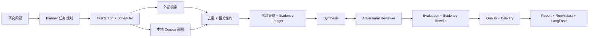

# LitAgent

[](./README.md)
[](./README.zh-CN.md)

LitAgent 是一个基于动态多 Agent 编排、对抗审查、混合检索和明确质量交付策略的
证据约束型学术文献综述系统。

系统会把研究问题拆解成运行时 DAG。外部搜索和本地召回共同构建带来源定位的证据账本，
Synthesis 生成的草稿需要经过 Adversarial Reviewer 挑战，最终报告必须通过 Evaluation、
Quality 和 Delivery 策略后才能标记为可发布。每次执行都可以通过本地 RunArtifact 和可选
LangFuse trace 进行回放。

## 项目状态

| 模块 | 状态 | 仓库证据 |
| --- | --- | --- |
| 动态 DAG 和对抗式 Survey 流程 | 已实现 | [`runner.py`](./src/litagent/runner.py)、[`test_phase14_4_e2e.py`](./tests/test_phase14_4_e2e.py) |
| 持久化 Paper Corpus 和 PDF ingestion | 已实现 | [`rag/`](./src/litagent/rag)、[`test_phase14_1.py`](./tests/test_phase14_1.py) |
| Retrieval benchmark | 已完成 | [`RESULTS.md`](./benchmarks/rag/RESULTS.md) |
| 端到端 Survey benchmark | 代码完成，等待 39 次真实运行验收 | [`benchmarks/survey`](./benchmarks/survey)、[`test_phase14_5.py`](./tests/test_phase14_5.py) |
| 可复现流程回放 | 已实现 | [`demo.py`](./src/litagent/demo.py)、[`test_phase14_6.py`](./tests/test_phase14_6.py) |

公开能力声明与证据的完整对应关系位于
[`docs/design-truth.md`](./docs/design-truth.md)。

## 快速开始

### 离线回放

离线模式不需要 API key、Docker、模型下载或网络访问。页面内置 `ready`、`blocked` 和
`partial` 三种交付状态样例。

```powershell
pip install -e ".[api]"
litagent demo
```

浏览器会自动打开 `http://127.0.0.1:8000/flow-demo`。只启动服务而不打开浏览器：

```powershell
litagent demo --no-browser
```

内置样例只是确定性的契约 fixture，不能作为模型质量或 benchmark 证据。


### 真实 Survey

将 `.env.example` 复制为 `.env`，配置 OpenAI-compatible LLM key，并启动项目基础设施：

```powershell
pip install -e ".[dev]"
docker compose up -d
litagent demo --live
```

LangFuse 是可选组件。配置完成后，回放页面会显示当前运行的 trace 链接。本地 artifact
保存在 `artifacts/runs/`，其中可能包含 prompt、论文片段和模型输出，因此不会进入 Git。

## 系统概览



运行时采用全异步实现。Search provider 和本地 Recall 可以并行执行，完成相关性过滤后，
Extraction 与 Graph Analysis 也可以并行。出现失败、取消或超时时，Scheduler 会把所有
任务收敛到明确终态，避免 artifact 把未完成任务表现为成功。

公开的数据流、信任边界、持久化和降级契约见
[`docs/system-overview.md`](./docs/system-overview.md)。

## 从问题到交付

1. **Planner**：把研究问题拆成规范化 sub-query 和依赖 DAG。
2. **Search 与 Recall**：并行查询外部学术来源和持久化本地 Corpus。
3. **Dedup 与 Relevance Gate**：合并论文身份、排序候选并拒绝弱相关结果。
4. **Extraction 与 Graph Analysis**：构建 Evidence、Claim、locator 和论文结构。
5. **Synthesis 与 Adversarial Review**：初稿和每轮修改共享同一份 run-scoped evidence selection。
6. **Evaluation 与 Rewrite**：评估引用、内部一致性和 faithfulness；修复候选只有通过校验和复评才会提交。
7. **Quality 与 Delivery**：根据执行完整性和内容质量输出 `ready`、`needs_review`、`blocked` 或 `partial`。
8. **Observability**：本地保存完整 artifact，可选向 LangFuse 上传递归脱敏后的事件投影。

## 已验证能力

| 能力 | 实现边界 | 验证证据 |
| --- | --- | --- |
| 动态 DAG 调度 | 依赖调度、重试、超时、取消和下游 skipped | [`test_orchestrator.py`](./tests/test_orchestrator.py)、[`test_phase14_4_e2e.py`](./tests/test_phase14_4_e2e.py) |
| 混合论文检索 | Named dense vector、BM25 sparse、RRF、可选 CrossEncoder | [`retriever.py`](./src/litagent/rag/retriever.py)、[`RESULTS.md`](./benchmarks/rag/RESULTS.md) |
| Corpus ingestion | Manifest、本地或 allowlisted arXiv PDF、质量门、section-aware chunking | [`ingest.py`](./src/litagent/rag/ingest.py)、[`test_phase14_1.py`](./tests/test_phase14_1.py) |
| 增量索引 | 稳定 point ID、embedding/payload hash、stale delete、CorpusState | [`corpus.py`](./src/litagent/rag/corpus.py)、[`test_phase14_3.py`](./tests/test_phase14_3.py) |
| Evidence 约束生成 | Synthesis 与 Reviewer 共享不可变的 Evidence selection | [`evidence.py`](./src/litagent/evidence.py)、[`test_phase13_9.py`](./tests/test_phase13_9.py) |
| 事务式 Evidence repair | 候选校验、复评以及 survey/evaluation/quality 原子提交 | [`runner.py`](./src/litagent/runner.py)、[`test_phase13_9.py`](./tests/test_phase13_9.py) |
| Trace 与回放 | 完整本地 artifact、SSE、LangFuse 脱敏 observation | [`recorder.py`](./src/litagent/observability/recorder.py)、[`test_run_recorder.py`](./tests/test_run_recorder.py) |
| Tool 与 MCP 控制 | 名称/类别 allowlist、JSON Schema、capability mapping、写操作 fail-closed | [`executor.py`](./src/litagent/tools/executor.py)、[`test_tools.py`](./tests/test_tools.py)、[`test_mcp.py`](./tests/test_mcp.py) |

## Retrieval Benchmark

Phase 14.3 使用 25 篇论文、15 条经过来源核对的 query，每条 query 重复运行三次。以下数据
来自仓库内冻结结果，不是估算值。

| Profile | Recall@5 | MRR@10 | nDCG@10 | p50 latency |
| --- | ---: | ---: | ---: | ---: |
| MiniLM + RRF baseline | 0.8867 | 0.8056 | 0.8238 | 14 ms |
| BM25 | 0.8778 | 0.9167 | 0.8817 | 4 ms |
| RRF + CrossEncoder rerank | 0.9089 | 1.0000 | 0.9406 | 647 ms |
| Selected-fulltext section-aware | 0.9222 | 0.8167 | 0.8426 | 61 ms |
| SPECTER2 + RRF | 0.9089 | 0.9333 | 0.8942 | 32 ms |

生产默认仍为 abstract + MiniLM + RRF。Reranker 能提高质量，但增加了明显延迟。
Section-aware 是当前优先的全文策略，但只有端到端 Survey benchmark 证明其产品收益后，
才考虑调整默认配置。

完整结果和解释边界见
[`benchmarks/rag/RESULTS.md`](./benchmarks/rag/RESULTS.md)。

## Survey Benchmark

版本化 Survey benchmark 包含 Few-shot、Vision Transformer 和 NeRF 三个领域共 15 个
case，以及 54 篇经过 judgment 的论文 Corpus。比较对象为：

- 仅使用 external search
- external search + abstract RAG
- external search + selected-fulltext RAG

实现和确定性测试已经完成，但正式 39 次真实运行以及 LangFuse/RunArtifact 验收尚未完成。
因此当前 README 不声明胜出 profile，也不声称全文 RAG 已经改善最终 Survey。

## 质量、安全与失败语义

- `ready`：执行完整、质量通过、允许发布。
- `needs_review`：执行完成，但质量未验证或存在关键降级。
- `blocked`：执行完整但质量失败，保留草稿且禁止发布。
- `partial`：因失败、取消、超时或预算终止造成执行不完整。

外部论文内容会经过 prompt injection 检测和 provenance 边界。Tool 调用必须满足已注册名称、
允许类别和合法 JSON 参数。未知 MCP capability 以及 write/destructive 操作默认拒绝。
API 使用全局并发限制和协作式 CancellationToken。

默认测试会阻止未标记网络访问，Integration 和 Live 测试使用显式 marker 和隔离存储身份。

```powershell
D:\miniconda3\envs\litagent\python.exe -m pytest tests -q -p no:cacheprovider --basetemp=.pytest-tmp-readme
```

## 项目结构

```text
src/litagent/
  agents/          Planner 和 DAG Worker
  orchestrator/    TaskGraph、Scheduler、重试、超时与取消
  rag/             Corpus ingestion、向量存储、检索和 Claims
  memory/          Working、Episodic、Semantic、Procedural Memory
  eval/            Citation、Consistency、Faithfulness Evaluation
  observability/   LangFuse、脱敏、RunArtifact 和 Archive
  benchmark/       Ingestion、Retrieval 和端到端 Survey Benchmark
  static/          Flow Replay 页面和离线样例
benchmarks/         版本化 Dataset、Profile 和审核结果
docs/               公开架构、ADR 和 Design Truth
tests/              默认离线、Integration 和 Live 测试
```

## 持久化边界

- **PostgreSQL**：Semantic/Procedural Memory 和可恢复的 CorpusState。
- **Qdrant**：Paper chunk、Trusted Claim 和 Episodic Memory，不同用途使用独立 collection。
- **Redis**：具有 TTL 的短期 Working Memory。
- **RunArtifact JSON**：完整本地执行回放。
- **Manifest 与原始资产**：派生向量索引的重建来源。

Docker Compose 为 PostgreSQL 和 Qdrant 使用 named volume。Working Memory 的临时语义不会
被描述成长任务断点恢复。

## 已知限制

- PDF 流程不包含 OCR、公式理解、表格抽取或图片理解。
- Benchmark Corpus 有意保持小规模和领域化，不能外推到任意学术检索任务。
- 独立 LLM Judge 是确定性指标的补充，不能替代领域专家审核。
- 当前是本地工程系统，不是具备认证、计费和多租户隔离的托管平台。
- 内置离线样例只验证回放契约，不衡量模型质量。

## 延伸文档

- [系统概览](./docs/system-overview.md)
- [Design Truth 与证据矩阵](./docs/design-truth.md)
- [Qdrant 与 Embedding ADR](./docs/adr/001-qdrant-and-embedding.md)
- [RAG Benchmark 方法](./benchmarks/rag/README.md)
- [Survey Benchmark 方法](./benchmarks/survey/README.md)
