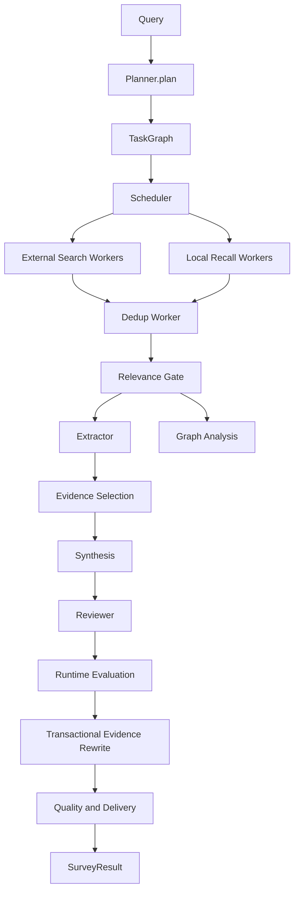

# LitAgent System Overview

This document describes the public, implementation-backed architecture at the
module and data-contract level. Function-level learning notes are intentionally
kept outside the public project documentation.

## Runtime Ownership

`LitAgent` in `runner.py` is the composition root. It creates shared Redis,
Qdrant, and PostgreSQL handles, wires workers and evaluators, owns the run
lifecycle, and closes resources exactly once. Optional infrastructure failures
degrade the corresponding capability without silently changing the final report
contract.

The public report is always a `SurveyResult` containing the survey text,
metadata, review history, graph data, execution completeness, evaluation,
quality, and delivery. API and CLI surfaces consume the same contract.

## Runtime Data Flow

The scheduler injects completed dependency outputs into each downstream task.
Workers therefore consume explicit upstream contracts rather than reading a
global mutable result map. Timeout, cancellation, and dependency failure are
converted into failed, cancelled, or skipped terminal states.

## Paper and Evidence Contracts

External APIs and PDF ingestion differ in available content, but both are
normalized into shared paper and chunk contracts. An abstract is a valid chunk
with no page or bounding-box locator. Full-text chunks can additionally preserve
section, page, source block, and optional bounding-box provenance.

The evidence layer assigns stable evidence IDs and keeps the paper identity,
selected text, locator, confidence, and content scope together. Synthesis and
every adversarial revision round receive the same run-scoped evidence selection.
Cross-run trusted claims remain advisory context for the Reviewer and cannot
replace current-run evidence citations.

## Corpus and Retrieval

The manifest is the versioned corpus declaration. Raw assets are validated before
parsing, parsed text passes a quality gate, and the configured chunker creates
stable chunk identities. `CorpusState` in PostgreSQL records ingestion progress
and content, embedding-input, and payload hashes.

Qdrant stores named dense and BM25 sparse vectors. Retrieval supports dense,
sparse, and RRF modes, with optional CrossEncoder reranking. Collection identity
contains fields that affect stored vector compatibility; query-time experimental
settings belong to the profile fingerprint instead.

Incremental synchronization distinguishes unchanged content, vector changes,
payload-only changes, new chunks, and stale chunks. A collection rebuild clears
the matching incremental state before repopulation so an empty index cannot be
mistaken for an up-to-date one.

## Evaluation and Delivery

Runtime evaluation measures citation accuracy, internal consistency, and
faithfulness. When evidence repair is attempted, the candidate report is kept
isolated until structure validation, reference validation, and post-rewrite
evaluation succeed. The commit replaces survey, evaluation, and quality as one
state transition.

Delivery is a policy result, not another evaluator:

- execution incomplete takes precedence and produces `partial`
- complete execution with failed quality produces `blocked`
- unverified quality or critical degradation produces `needs_review`
- only complete, passed output produces `ready` and `publishable=true`

## Memory and Claims

- Working Memory uses Redis and TTL semantics for active-run context.
- Episodic Memory uses Qdrant for prior run summaries.
- Semantic and Procedural Memory use PostgreSQL.
- Claims Index stores only claims promoted after successful quality and delivery.

Content-bearing memory consolidation runs after evaluation and delivery. Reports
that are partial or not publishable cannot promote their content into trusted
cross-run memory.

## Observability and Replay

Runtime components emit stable lifecycle events for Survey, Worker, LLM, Tool,
RAG, Memory, Claims, Evaluation, and rewrite operations. `RunRecorder` consumes
the full local payload and pairs start/terminal events into execution nodes.

LangFuse receives a recursively redacted event projection. Credentials and
sensitive headers are removed while non-secret prompts, inputs, outputs, and
token usage remain inspectable. The local artifact and remote trace are linked
by an optional trace ID and URL.

The `/flow-demo` UI reads a server-side `FlowDemoView` projection. It does not
reimplement quality or delivery policy in JavaScript. Raw local artifacts remain
downloadable for detailed inspection.

## Persistence and Rebuild Boundaries

| Data | Source of truth | Lifecycle |
| --- | --- | --- |
| Corpus declaration | Versioned manifest | Durable |
| Raw PDF assets | Local artifact directory | Durable, private |
| Parsed chunks | Rebuildable artifact | Durable, private |
| Paper and claims vectors | Qdrant named volume | Rebuildable |
| Corpus incremental state | PostgreSQL named volume | Durable |
| Working Memory | Redis | TTL and disposable |
| Run replay | Local RunArtifact JSON | Durable, private |
| LangFuse trace | Optional LangFuse deployment | Operational telemetry |

## Degradation Boundaries

Unavailable Memory, Claims, local RAG, or one external source is represented by
stable reason codes and trace events. A fallback must preserve the public output
shape. Complete failure of relevant sources, incomplete DAG execution, failed
quality, and unverified quality remain distinct delivery outcomes.
